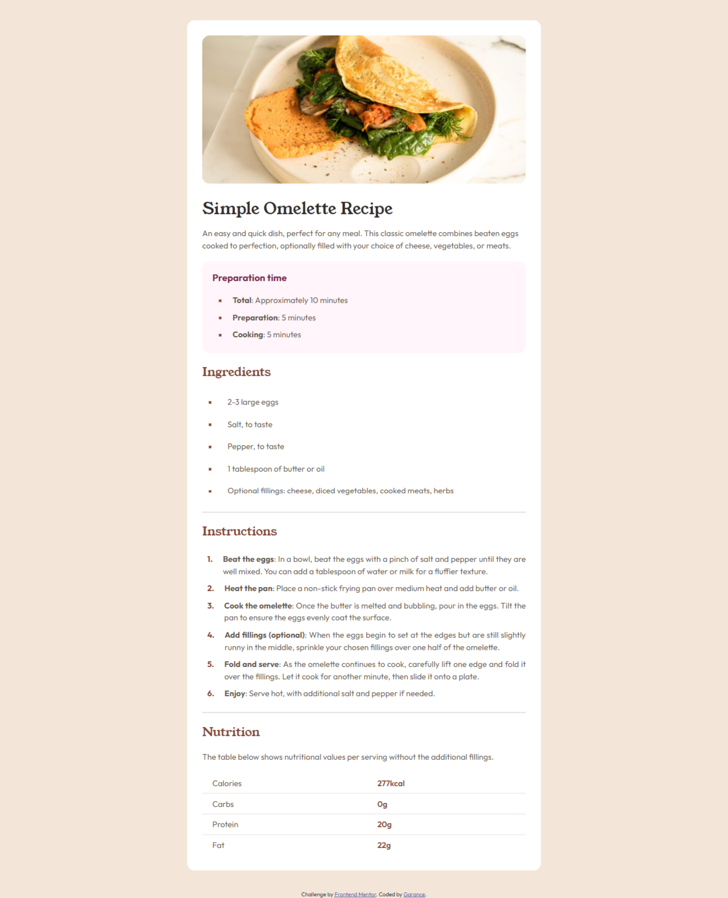
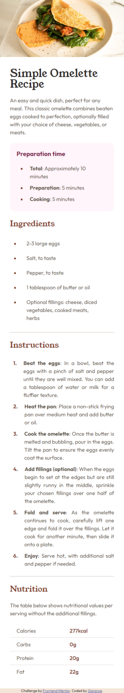

# Frontend Mentor - Recipe page solution

This is a solution to the
[Recipe page challenge on Frontend Mentor](https://www.frontendmentor.io/challenges/recipe-page-KiTsR8QQKm). Frontend
Mentor challenges help you improve your coding skills by building realistic projects.

## Table of contents

- [Overview](#overview)
  - [The challenge](#the-challenge)
  - [Screenshot](#screenshot)
  - [Links](#links)
- [My process](#my-process)
  - [Built with](#built-with)
- [Author](#author)

## Overview

### Screenshot

 

### Links

- Solution URL: [Frontend Mentor](https://www.frontendmentor.io/solutions/recipe-page-mobile-first-Ef1GKW8iR_)
- Live Site URL: [Github](https://dgarance.github.io/recipe-page/)

## My process

### Built with

- Semantic HTML5 markup
- CSS custom properties
- Flexbox
- CSS Grid
- Mobile-first workflow

## Author

- Github - [DGarance](https://github.com/DGarance)
- Frontend Mentor - [@DGarance](https://www.frontendmentor.io/profile/DGarance)
- Twitter - [@DGarance](https://twitter.com/Akane9721)
